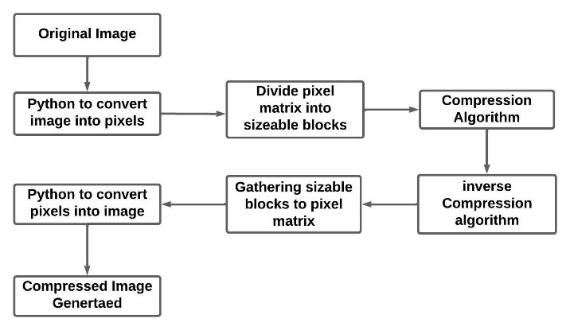
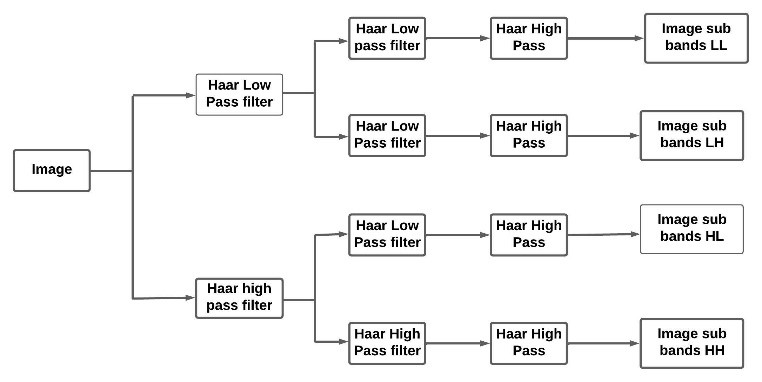
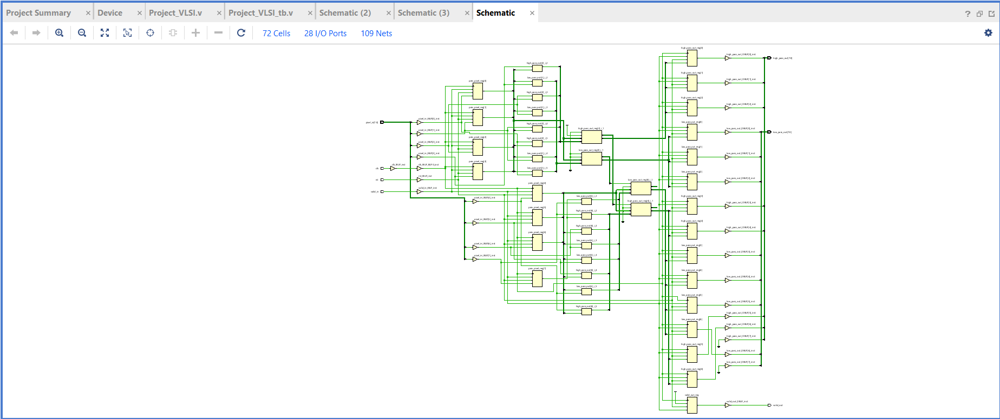
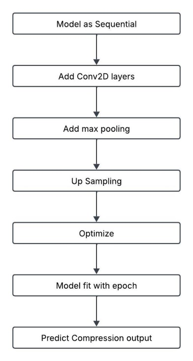
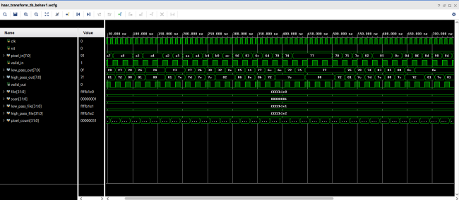
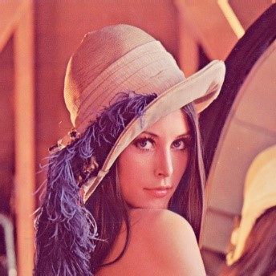

<div align="center">

# Optimized Image Compression Using Haar Wavelet and Convolutional Autoencoder

### A hybrid hardware/software image compression pipeline combining an FPGA-synthesized Haar wavelet transform with a Python-trained convolutional autoencoder


</div>

---

## 1. Project Summary

| Item | Details |
|---|---|
| Project | Optimized Image Compression — Haar Wavelet + Convolutional Autoencoder |
| Tools Used | Xilinx Vivado (RTL/HLS), Python (Keras, TensorFlow, OpenCV, NumPy) |
| Design Type | Hybrid hardware (Verilog) + software (CNN autoencoder) pipeline |
| Techniques | 2D Haar Wavelet Transform, Convolutional Autoencoder, Sub-band Decomposition |
| Test Frequency | 100 MHz |
| Best Result | 86% image size reduction (462 KB → 52 KB) at PSNR 15.44 dB, SSIM 0.79 |

---

## 2. Engineering Problem

Images make up a dominant share of data transmitted and stored online, and traditional compression methods struggle to keep pace with growing bandwidth and storage demands. This project targets that gap with a hybrid compression pipeline: a **Haar wavelet transform** first decomposes each image into low- and high-frequency sub-bands (implemented in Verilog and synthesized in Vivado for hardware acceleration), and a **convolutional autoencoder** then compresses those sub-bands further into a compact, non-interpretable latent-space representation — reducing distortion and improving throughput compared to compressing raw pixel data directly.

---

## 3. Design Flow

```
Original RGB Image
        ↓
Grayscale Conversion (Python)
        ↓
Pixel Extraction → Text File
        ↓
Haar Wavelet Transform (Verilog, synthesized in Vivado)
        ↓
Sub-band Decomposition (LL, LH, HL, HH)
        ↓
Convolutional Autoencoder (Python / Keras)
        ↓
Latent-Space Compressed Representation
        ↓
Inverse Haar Transform → Reconstructed Image
```



---

## 4. Theory — Haar Wavelet Decomposition

The Haar transform is applied as a 1D wavelet first, then extended to 2D by applying it row-wise and then column-wise, producing four sub-bands per decomposition level:

```
A(i,j) = (I(i,2j) + I(i,2j+1)) / 2      — low-pass (approximation)
D(i,j) = (I(i,2j) − I(i,2j+1)) / 2      — high-pass (detail)
```

The same operation is repeated on the columns to produce the four final sub-bands:

- **LL** — low-pass in both row and column (approximation — holds most of the image's energy)
- **LH** — low-pass row, high-pass column
- **HL** — high-pass row, low-pass column
- **HH** — high-pass in both row and column (fine detail)



This sparsity — most of the image's information concentrated in the LL sub-band — is exactly what makes wavelet-domain compression effective: the high-frequency sub-bands can be compressed far more aggressively than the low-frequency ones without a proportional loss in perceptual quality.

---

## 5. Methodology

### 5.1 Hardware Stage — Haar Transform (Vivado)

Since Verilog doesn't support image data types directly, each RGB test image is first converted to grayscale in Python, then converted to raw pixel values and written to a text file. This file is read into the Verilog Haar transform module, simulated and synthesized in Vivado. For a 128×128 test image, the transform produces two output files (`low_pass_file` and `high_pass_file`), each containing 16,384 compressed values.



### 5.2 Software Stage — Convolutional Autoencoder (Python)

The Haar-transformed values are passed to a convolutional autoencoder built in Keras (TensorFlow backend):

- **Convolution layers** extract features via learnable filters (stride = 2)
- **ReLU activation** adds non-linearity while remaining computationally cheap (negative values → 0)
- **Max pooling** and **upsampling** manage spatial resolution through the encode/decode path
- **Optimizer** adjusts model parameters to converge toward a minimal reconstruction loss
- Trained for **2,000 epochs**



### 5.3 Design Decisions

Compressing raw pixels directly with a CNN would mean the network has to learn both spatial redundancy *and* frequency-domain structure from scratch. Splitting that work — letting the Haar transform handle frequency-domain sparsity in hardware first, and letting the autoencoder specialize in latent-space compression second — reduces the burden on the autoencoder and keeps the compute-heavy Haar stage off the CPU/GPU entirely, since it runs as synthesized hardware.

---

## 6. Simulation & Synthesis Environment

| Parameter | Value |
|---|---|
| HDL / Hardware Tool | Verilog, Xilinx Vivado |
| Software Stack | Python — Keras, TensorFlow, OpenCV, NumPy |
| Test Image Size | 128 × 128 |
| Test Frequency | 100 MHz |
| Training Epochs | 2,000 |
| Activation Function | ReLU |
| Convolution Stride | 2 |

---

## 7. Results

### 7.1 Hardware Resource Utilization

| Resource | Total | Available | Utilization (%) |
|---|---|---|---|
| BRAM | 43 | 132 | 32% |
| DSP | 15 | 192 | 8% |
| FF | 831 | 55,244 | 2% |
| LUT | 1,104 | 27,622 | 4% |

The synthesized Haar transform module uses only 4% of available LUTs and 8% of DSP resources at 100 MHz, meaning this design comfortably fits on lower-resource FPGA boards without becoming the bottleneck in the overall pipeline.



### 7.2 Compression Results

| Original Image | Reconstructed Image |
|---|---|
|  |  |

| Metric | Original | Reconstructed |
|---|---|---|
| PSNR (dB) | 15.64 | 15.44 |
| SSIM / MS-SSIM | 0.81 | 0.79 |
| Size (KB) | 462 | 52 |

**Compression ratio: 86% size reduction**, with the reconstructed image remaining visibly smooth and recognizable — a moderate, well-controlled distortion trade-off for the compression achieved.

---

## 8. Discussion

The 86% size reduction confirms the core hypothesis: separating frequency-domain decomposition (Haar) from learned latent-space compression (autoencoder) is more resource-efficient than asking a single stage to do both. The PSNR/SSIM drop between original and reconstructed images is small (0.20 dB and 0.02 respectively), indicating the autoencoder is not introducing significant additional distortion beyond what the Haar transform's high-frequency discarding already accounts for.

### Engineering Trade-offs

| Design Choice | Benefit | Cost |
|---|---|---|
| Haar transform in hardware (Verilog/Vivado) | Offloads compute from CPU/GPU, real-time capable | Requires FPGA resources (BRAM/DSP/LUT) |
| Discarding high-frequency sub-bands | Higher compression ratio | Fine image detail is lost |
| Autoencoder latent-space compression | Non-interpretable, compact representation; harder to reverse-engineer | Requires training data and 2,000-epoch training time |
| Grayscale conversion before hardware stage | Simplifies Verilog implementation (single channel) | Loses color information entirely |

This project builds on a base paper's Haar + autoencoder approach, replicating the core methodology but training the autoencoder on a different dataset to evaluate compression efficiency across different image types.

---

## 9. Key Takeaways

- Combining a hardware-synthesized wavelet transform with a software-trained autoencoder achieves strong compression (86%) while keeping FPGA resource usage low (≤32% across all resource types).
- Sub-band decomposition via the Haar transform concentrates most image information into the low-pass (LL) band, making the high-frequency bands attractive compression targets with minimal perceptual cost.
- The measured PSNR/SSIM degradation between original and reconstructed images was small, showing the autoencoder stage adds only modest additional distortion on top of the Haar transform.
- Splitting the compression pipeline across hardware and software stages reduces the computational burden on any single stage — the FPGA handles frequency-domain decomposition, while the CPU/GPU-trained network handles only latent-space compression.

---

## 10. Future Work

- Integrate more advanced generative models (e.g., variational autoencoders) in place of the standard convolutional autoencoder
- Explore behavioral-level configuration selection to optimize specifically for FPGA resource efficiency
- Extend testing across a wider variety of image types and resolutions beyond 128×128
- Evaluate color (non-grayscale) compression pipelines

---

## 11. What I Learned

This project deepened my understanding of how hardware/software co-design can be used to split a computationally demanding task across the domains best suited for each part — using Verilog and Vivado for the deterministic, real-time-capable wavelet transform, and Python/Keras for the data-driven, trainable compression stage. I also learned how to evaluate compression quality quantitatively (PSNR, SSIM) rather than relying on visual inspection alone, and how sub-band decomposition provides a principled basis for deciding what to preserve and what to discard when compressing image data.

---

## 12. Conclusion

This project develops an efficient image compression technique by combining the Haar wavelet transform with a convolutional autoencoder. The Haar transform decomposes pixel values into approximations and details, and the encoder compresses them further by mapping them to a latent-space representation. This hybrid system reduces image size by 86%; though some distortion is observed in the compressed image, it remains within a manageable range. The result demonstrates a viable approach for efficient image compression suitable for bandwidth-constrained environments, with potential to reduce storage and transmission costs in real-time compression applications.

---

## 13. References

This project builds on and adapts approaches from the following works, particularly the FPGA-based Haar + autoencoder hybrid methodology:

1. S. Joshi, K. Indra, M. Nagabhushanam, "Image Compression and Decompression with Configurable Architecture on FPGA platform," IEEE 2022.
2. B. Liu, M. Xie, Z. Guan, B. Ynag, Z. Yang, "Design and Implementation of image compression based on FPGA," IEEE 2024.
3. M. K. Wali, Z. Qasim, "Comparison of Implementations between Haar Wavelet Transform and FFT on FPGA," IJESE 2018.
4. S. Sarkar, S. S. Bhairannawar, "Efficient FPGA architecture of optimizing Haar wavelet transform for image and video processing applications," Springer 2021.

---

## License

This project is shared under the MIT License — see [LICENSE](LICENSE) for details.
